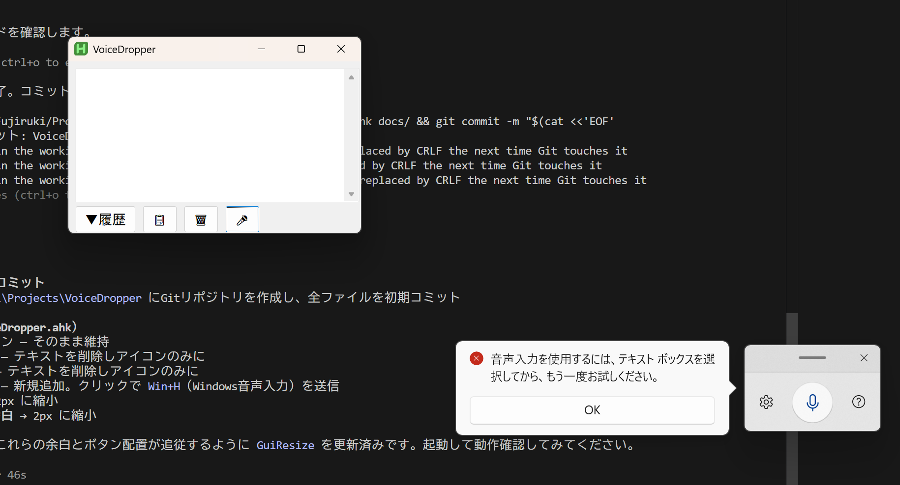

# VoiceDropper

音声入力メモをChromeリモートデスクトップへ橋渡しする、Windows向け常駐型ミニツール。

## 解決する課題

Chromeリモートデスクトップ経由でリモートPCを操作する際、**ローカルPCの音声入力をリモートPC側に直接入力できない**問題を解決します。

## 使い方

1. **🎤 ボタン**で音声入力を起動し、テキストボックスに話す
2. **Chromeリモートデスクトップに切り替え** → メモが自動でクリップボードにコピー
3. リモートPC側で **Ctrl+V** で貼り付け

## 機能

| ボタン | 機能 |
|:--|:--|
| ✕ | アプリ終了 |
| ⚙ | 設定画面（対象ウィンドウ選択・履歴件数） |
| ▼履歴 | コピー履歴をドロップダウン表示 |
| 最前面 | 常時最前面表示のON/OFF |
| 📋 | 手動コピー |
| 🗑 | 履歴に保存してクリア |
| 🎤 | Windows音声入力（Win+H）起動 |

- **フォーカス検知**: 対象ウィンドウに切り替えた瞬間に自動コピー
- **タイトルバーレス**: コンパクトな外観、どこをドラッグしても移動可能
- **設定画面**: 自動コピーの対象ウィンドウをリストから複数選択可能
- **履歴管理**: 最大100件まで保持、ドロップダウンから復元

## インストール

### exe版（推奨）

[Releases](https://github.com/fujiruki/VoiceDropper/releases) から `VoiceDropper.zip` をダウンロードして解凍。`VoiceDropper.exe` をダブルクリックで起動。

### スクリプト版

[AutoHotkey v2.0](https://www.autohotkey.com/) をインストールした上で、`VoiceDropper.ahk` をダブルクリック。

### スタートアップ登録

`VoiceDropper.exe`（または `.ahk`）のショートカットを `shell:startup` に配置すると、PC起動時に自動で立ち上がります。

## 動作環境

- Windows 10 / 11
- exe版: 追加インストール不要
- ahk版: AutoHotkey v2.0 以上

## ライセンス

MIT License

## 開発者

**藤田建具店** — [door-fujita.com](https://door-fujita.com)

- [ランディングページ](https://door-fujita.com/contents/VoiceDropper/)
- [オンラインショップ](https://doorfujita.buyshop.jp/)
